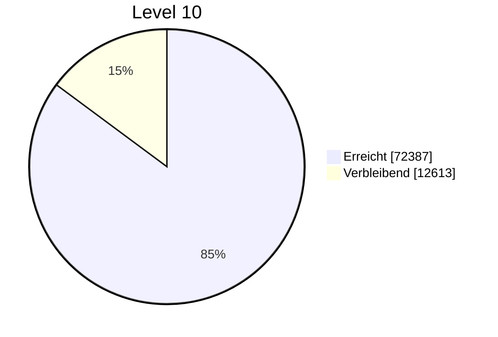

# Der Barde - Dungeons \& Dragons 5e

## Klassenübersicht

Ob Gelehrter, Skalde oder Halunke - ein Barde webt Magie in seine Musik und seine Worte ein, um Verbündete zu inspirieren, Feinde zu entmutigen, das Bewusstsein zu beeinflussen, Illusionen zu erschaffen und sogar um Wunden zu heilen.

## Stufenaufstieg

| Stufe | Übungsbonus | Merkmale | Bekannte Zaubertricks | Bekannte Zauber | 1. | 2. | 3. | 4. | 5. | 6. | 7. | 8. | 9. |
| :-- | :-- | :-- | :-- | :-- | :-- | :-- | :-- | :-- | :-- | :-- | :-- | :-- | :-- |
| 1 | +2 | Zauberwirken, Bardische Inspiration (d6) | 2 | 4 | 2 | - | - | - | - | - | - | - | - |
| 2 | +2 | Alleskönner, Lied der Erholung (d6), Magische Inspiration (optional) | 2 | 5 | 3 | - | - | - | - | - | - | - | - |
| 3 | +2 | Bardenschule, Expertise | 2 | 6 | 4 | 2 | - | - | - | - | - | - | - |
| 4 | +2 | Attributswerterhöhung, Bardische Vielseitigkeit (optional) | 3 | 7 | 4 | 3 | - | - | - | - | - | - | - |
| 5 | +3 | Bardische Inspiration (d8), Quelle der Inspiration | 3 | 8 | 4 | 3 | 2 | - | - | - | - | - | - |
| 6 | +3 | Bannlied, Merkmal: Bardenschule | 3 | 9 | 4 | 3 | 3 | - | - | - | - | - | - |
| 7 | +3 | - | 3 | 10 | 4 | 3 | 3 | 1 | - | - | - | - | - |
| 8 | +3 | Attributswerterhöhung | 3 | 11 | 4 | 3 | 3 | 2 | - | - | - | - | - |
| 9 | +4 | Lied der Erholung (d8) | 3 | 12 | 4 | 3 | 3 | 3 | 1 | - | - | - | - |
| 10 | +4 | Bardische Inspiration (d10), Expertise, Magische Geheimnisse | 4 | 14 | 4 | 3 | 3 | 3 | 2 | - | - | - | - |
| 11 | +4 | - | 4 | 15 | 4 | 3 | 3 | 3 | 2 | 1 | - | - | - |
| 12 | +4 | Attributswerterhöhung | 4 | 15 | 4 | 3 | 3 | 3 | 2 | 1 | - | - | - |
| 13 | +5 | Lied der Erholung (d10) | 4 | 16 | 4 | 3 | 3 | 3 | 2 | 1 | 1 | - | - |
| 14 | +5 | Magische Geheimnisse, Merkmal: Bardenschule | 4 | 18 | 4 | 3 | 3 | 3 | 2 | 1 | 1 | - | - |
| 15 | +5 | Bardische Inspiration (d12) | 4 | 19 | 4 | 3 | 3 | 3 | 2 | 1 | 1 | 1 | - |
| 16 | +5 | Attributswerterhöhung | 4 | 19 | 4 | 3 | 3 | 3 | 2 | 1 | 1 | 1 | - |
| 17 | +6 | Lied der Erholung (d12) | 4 | 20 | 4 | 3 | 3 | 3 | 2 | 1 | 1 | 1 | 1 |
| 18 | +6 | Magische Geheimnisse | 4 | 22 | 4 | 3 | 3 | 3 | 3 | 1 | 1 | 1 | 1 |
| 19 | +6 | Attributswerterhöhung | 4 | 22 | 4 | 3 | 3 | 3 | 3 | 2 | 1 | 1 | 1 |
| 20 | +6 | Überlegene Inspiration | 4 | 22 | 4 | 3 | 3 | 3 | 3 | 2 | 2 | 1 | 1 |

## Grundlegende Eigenschaften

### Voraussetzung für Klassenkombination

**Charisma 13**

### Trefferpunkte

- **Trefferwürfel:** 1W8 pro Stufe als Barde
- **Trefferpunkte auf Stufe 1:** 8 + dein Konstitutionsmodifikator
- **Trefferpunkte auf höheren Stufen:** 1W8 (oder 5) + dein Konstitutionsmodifikator pro Stufe als Barde über die 1. Stufe hinaus

### Übungen

- **Rüstungen:** leichte Rüstungen
- **Waffen:** einfache Waffen, Handarmbrüste, Langschwerter, Rapiere und Kurzschwerter
- **Werkzeuge:** drei Musikinstrumente deiner Wahl

### Rettungswürfe

- **Geschicklichkeit**
- **Charisma**

### Fertigkeiten

**Drei beliebige deiner Wahl**

### Startausrüstung

- (a) ein Rapier, (b) ein Langschwert oder (c) eine einfache Waffe
- (a) Diplomatenausrüstung oder (b) Unterhaltungskünstler-Ausrüstung
- (a) eine Laute oder (b) ein anderes Musikinstrument
- eine Lederrüstung und ein Dolch

## Zauberwirken

Du hast gelernt, das Gewebe der Realität mit Hilfe deines Willens und deiner Musik zu entwirren und zu formen. Deine Zaubersprüche sind Teil eines gewaltigen Repertoires, mit dem du deine Magie auf unterschiedliche Situationen einstimmen kannst.

### Zaubertricks

Zu Beginn sind dir zwei beliebige Zaubertricks aus der Zauberliste des Barden bekannt. Weitere deiner Wahl lernst du auf höheren Stufen, so wie es in der Spalte für bekannte Zaubertricks in der Aufstiegstabelle des Barden angegeben ist.

### Zauberplätze

Die Aufstiegstabelle des Barden gibt an, wie viele Zauberplätze pro Grad dir auf jeder Stufe zur Verfügung stehen. Um einen dir bekannten Spruch zu wirken, musst du einen Zauberplatz des gleichen oder eines höheren Grades verbrauchen. Alle verbrauchten Zauberplätze stehen dir nach einer langen Rast wieder zur Verfügung.

### Bekannte Zauber des 1. Grades und höher

Auf Stufe 1 kennst du vier frei wählbare Zauber des 1. Grades aus der Zauberliste des Barden. Der Spalte „Bekannte Zauber" der Tabelle kannst du entnehmen, wie viele neue Sprüche du dir bei einem Stufenaufstieg aus der Zauberliste des Barden aussuchen darfst.

### Attribut zum Zauberwirken

Das Attribut, mit dem du deine Bardenzauber wirkst, ist **Charisma**. Deine Magie stammt aus dem Herzen und der Seele, die du in die Darbietungen deiner Musik oder Reden einfließen lässt.

- **SG für Rettungswürfe** = 8 + dein Übungsbonus + dein Charismamodifikator
- **Modifikator für Zauberangriffe** = dein Übungsbonus + dein Charismamodifikator

### Rituale Wirken

Du kannst jeden Bardenzauber, der dir bekannt ist, auch als Ritual wirken, falls dieser als solches gekennzeichnet ist.

### Zauberfokus

Als Zauberfokus für deine Bardenzauber kannst du ein Musikinstrument verwenden.

## Klassenmerkmale

### Bardische Inspiration

Du vermagst andere zu inspirieren, indem du eine bewegende Rede hältst oder ermutigende Musik erklingen lässt. Als Bonusaktion kannst du in deinem Zug innerhalb von 18 m Reichweite eine Kreatur außer dir selbst bestimmen, die in der Lage sein muss, dich zu hören. Diese Kreatur erhält einen bardischen Inspirationswürfel, auf der 1. Stufe einen W6.

Der Inspirationswürfel ändert sich auf folgenden Stufen:

- **Stufe 5:** W8
- **Stufe 10:** W10
- **Stufe 15:** W12

### Alleskönner *(Stufe 2)*

Ab der 2. Stufe kannst du deinen halben Übungsbonus (abgerundet) auf jeden Attributswurf addieren, der nicht bereits durch deinen Übungsbonus verbessert wird.

### Lied der Erholung *(Stufe 2)*

Von der 2. Stufe an kannst du während einer kurzen Rast mit sanfter Musik oder Gesängen den Heilungsprozess deiner verwundeten Verbündeten beschleunigen.

Die zusätzlichen Trefferpunkte erhöhen sich:

- **Stufe 2:** 1W6
- **Stufe 9:** 1W8
- **Stufe 13:** 1W10
- **Stufe 17:** 1W12

### Magische Inspiration *(Stufe 2, Optional)*

Wenn eine Kreatur über einen bardischen Inspirationswürfel von dir verfügt und einen Zauber wirkt, der Trefferpunkte wiederherstellt oder Schaden zufügt, kann die Kreatur damit würfeln und das Ergebnis zu den Trefferpunkten oder dem Schaden addieren.

### Bardenschule *(Stufe 3)*

Auf Stufe 3 wirst du in die fortgeschrittenen Techniken einer Bardenschule deiner Wahl eingeweiht. Deine Wahl verleiht dir auf der 3., 6. und 14. Stufe jeweils ein Merkmal.

### Expertise *(Stufe 3)*

Mit Stufe 3 wählst du zwei deiner Fertigkeiten aus, in denen du geübt bist. Dein Übungsbonus wird bei allen Attributswürfen verdoppelt, bei denen diese Fertigkeiten zur Anwendung kommen. Auf der 10. Stufe kannst du dir zwei weitere deiner geübten Fertigkeiten aussuchen.

### Attributswerterhöhung *(Stufe 4, 8, 12, 16, 19)*

Beim Erreichen der 4. Stufe und dann wieder auf der 8., 12., 16. und 19. Stufe kannst du einen Attributswert deiner Wahl um 2 Punkte erhöhen oder zwei Attributswerte um jeweils 1 Punkt erhöhen.

### Bardische Vielseitigkeit *(Stufe 4, Optional)*

Wenn du mit dieser Klasse eine Stufe erreichst, die dir das Merkmal Attributswerterhöhung gewährt, kannst du eine Fertigkeit für Expertise oder einen Zaubertrick ersetzen.

### Quelle der Inspiration *(Stufe 5)*

Von der 5. Stufe an erhältst du all deine Anwendungen der Bardischen Inspiration zurück, sobald du eine kurze oder lange Rast beendet hast.

### Bannlied *(Stufe 6)*

Auf Stufe 6 erlangst du die Fähigkeit, mit Zaubern gewobene Musik und Worte der Macht zu nutzen, um geistesbeeinflussende Effekte abzuwenden. Als Aktion kannst du eine Darbietung geben, die bis zum Ende deines nächsten Zuges andauert.

### Magische Geheimnisse *(Stufe 10, 14, 18)*

Mit Erreichen der 10. Stufe hast du bereits aus einem breiten Spektrum an Disziplinen magisches Wissen zusammengetragen. Wähle zwei Zauber beliebiger Klassen, einschließlich des Barden. Du lernst zwei weitere Zauber beliebiger Klassen auf Stufe 14 und erneut auf Stufe 18.

### Überlegene Inspiration *(Stufe 20)*

Hast du ab der 20. Stufe zum Zeitpunkt des Initiativewurfs keine Anwendung von Bardische Inspiration mehr zur Verfügung, erhältst du eine Anwendung zurück.

## Bardenschulen

### Schule der Eloquenz

**Silberzunge *(Stufe 3)*:** Du kannst W20-Augenzahlen von 9 oder geringer bei Charisma (Überzeugen) oder Charisma (Täuschen) als 10 behandeln.

**Verstörende Worte *(Stufe 3)*:** Als Bonusaktion kannst du deine Bardische Inspiration einsetzen, um eine Kreatur zu verunsichern.

**Unfehlbare Inspiration *(Stufe 6)*:** Wenn eine Kreatur einen deiner Würfel der Bardischen Inspiration verwendet und der Wurf scheitert, kann die Kreatur den Würfel behalten.

**Universelle Sprache *(Stufe 6)*:** Du kannst dich für alle Kreaturen verständlich ausdrücken.

**Ansteckende Inspiration *(Stufe 14)*:** Wenn eine Kreatur erfolgreich einen deiner Inspirationswürfel verwendet, kannst du einer anderen Kreatur einen weiteren Würfel geben.
